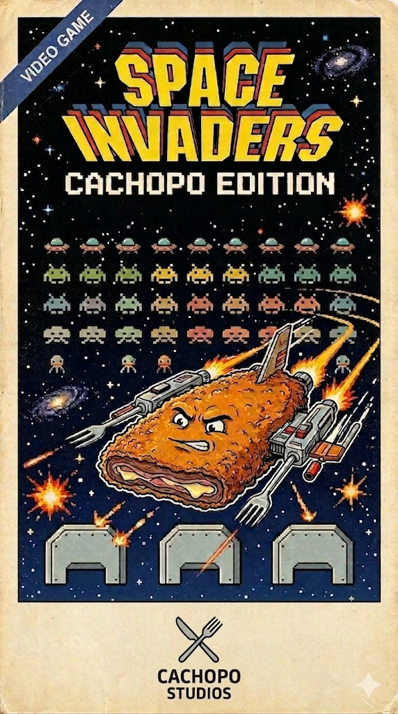

# Space Invaders

Proyecto de Space Invaders desarrollado en Java por **Cachopín** con el patrón **MVC + Observer**.

---

## Ramas del proyecto

| Rama | Propósito |
|------|-----------|
| `main` | Versión estable del **sprint actual**. Solo se mergea a aquí cuando la funcionalidad está completa y probada. |
| `develop` | Rama de **desarrollo activo**. Aquí se integran los cambios en curso antes de pasar a `main` y se va trabajando en el siguiente sprint. |

> Crear ramas de feature a partir de `develop`, mergear también a esta.

---

## Arquitectura

El proyecto sigue el patrón **MVC + Observer**:

- **Modelo** (`model/`): Contiene los datos y la lógica del juego. `Espacio` es el modelo principal y extiende `Observable`, notificando automáticamente a las vistas cuando el estado cambia.
- **Vista** (`viewController/`): `StartFrame` y `MainFrame` implementan `Observer` y solo se encargan de representar el estado del modelo. No contienen lógica de negocio.
- **Controlador**: Clase privada interna dentro de cada vista que gestiona los eventos del usuario y llama al modelo.

---

## Controles del juego (actualmente)

| Tecla | Acción |
|-------|--------|
| `←` `→` `↑` `↓` | Mover la nave |
| `SPACE` | Disparar |
| `SPACE` (inicio) | Iniciar partida |